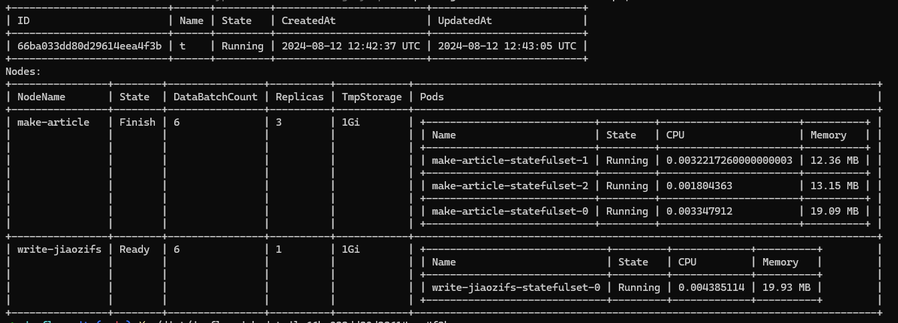

# JiaoZiFlow

A flexible, extensible, and customizable pipeline.

## Overview

jiaoziflow is a versatile pipeline framework designed for the concurrent preprocessing of various data types, including tables, images, videos, and text. It enables users to define and customize the behavior of each node, seamlessly integrating with Jiaozifs to unlock the potential of versioned data. jiaoziflow is built for cloud-native deployment, offering flexible scaling to handle large data volumes.

## Features

- Multi-type Data Support: Process table data, images, videos, and text.
- Concurrent Execution: Leverage parallel processing for high efficiency and scalability.
- Customizable Nodes: Users can freely define and tailor the behavior of each pipeline node.
- Jiaozifs Integration: Enhanced data versioning capabilities for more robust data management.
- Cloud-Native: Designed for easy deployment and scaling in cloud environments.

## Requirements

1. Rust: Requires Rust 1.80.1 or higher. [Install Rust](https://www.rust-lang.org/tools/install)
2. MongoDB: Used to store runtime data. [Install MongoDB](https://www.mongodb.com/zh-cn/docs/manual/installation/)
3. Protobuf: Utilizes Protocol Buffers for data exchange between nodes. [Install Protobuf Compiler](https://grpc.io/docs/protoc-installation/)
4. Kubernetes: Relies on Kubernetes for deployment and scaling. Requires K8s 1.21 or higher. [Install Kubernetes](https://kubernetes.io/docs/setup/)
5. StorageClass: Require a storage class named ```jz-flow-fs```

## Quick Start

### 1. Build

```
git clone https://github.com/GitDataAI/jiaoziflow.git
build-jz
```

### 2. Run Daemon

```
# dont specify the database; it is created dynamically.
./dist/jz-flow daemon --mongo-url mongodb://<ip>:27017
```


### 3. Run a Example Flow

```
./dist/jz-flow job create --name simple --path ./script/example_dag.json  # Create a job and deploy all pods
./dist/jz-flow job run <job id>                                           # Start the job
```

### 4. Monitor the Job
```
./dist/jz-flow job detail <job id>                                        # Monitor the job's details
```

